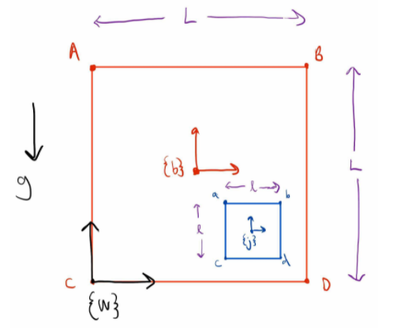

# Dice_in_Cup

The Dice in Cup project was done for the final assignment of Northwestern University’s [Theory of Machines - Dynamics (MECH_ENG 314)](https://www.mccormick.northwestern.edu/mechanical/academics/courses/descriptions/314-theory-of-machines-dynamics.html) course to simulate the dynamics of a 2-dimensional square dice (or jack) bouncing around inside a cup (or box) that is being shaken up by external forces under gravity. The physics of both the dice and the cup was derived and simulated from scratch using the [SymPy](https://www.sympy.org/en/index.html) package in Python, and both [Lagrangian dynamics](https://en.wikipedia.org/wiki/Lagrangian_mechanics) and [rigid body transformations](https://en.wikipedia.org/wiki/Transformation_matrix#:~:text=9%20External%20links-,Uses,consistent%20format%2C%20suitable%20for%20computation.&text=These%20include%20both%20affine%20transformations,used%20in%203D%20computer%20graphics.) were used to generate the trajectory of these two objects. Other topics such as multiple impacts, rotational inertia, and symbolic vs. numeric calculations were also explored in this project. The final simulation looks like this:

https://user-images.githubusercontent.com/66648349/146699835-4f572bf3-03d7-4648-9cc7-e723f4b63035.mp4

The overall process of generating the simulation is as the following:

1. First, define the coordinate system (**q = [xb, yb, xj, yj, θb, θj]**), frames (jack frame, box frame, and a fixed world frame), and the frames’ relative transformation matrices **Gwj** (transforms jack coordinates to world coordinate) and **Gwb** (transforms box coordinate to world coordinate). The jack and box frames have origins at the center of mass (CoM) of both these objects. A diagram of the system can be seen in the image below:

  

2. Define the total kinetic energy (**KE**) and potential energy (**PE**) of the system (jack + box). **M** here is defined as the 6x6 three dimensional inertia matrix of the object (note that only inertia about z is being considered here since the simulation is two dimensional) and **Vb**= where the superscript v represents taking the skew-symmetric form of the vector and **G** represents the transformation matrix (could be Gwb or Gwj depending on whether one is determining the KE of the jack or box.). **m** is simply the mass of the object and **g** is the gravity scalar 9.8 m/s2.

  

  

3. Calculate the [Lagrangian](https://en.wikipedia.org/wiki/Lagrangian_mechanics#The_Lagrangian) ().
4. Derive the forced [Euler-Lagrange](https://en.wikipedia.org/wiki/Euler%E2%80%93Lagrange_equation#Statement) (EL) equations to simulate the trajectory of the jack and the box when it is not actively impacting. Forces in the xb and yb direction are added here to “shake up” the box. The equations are shown below where F is a 6-vector consisting of Fx, Fy, and zeros:

  

5. Calculate the [Hamiltonian](https://en.wikipedia.org/wiki/Hamiltonian_mechanics#From_Euler-Lagrange_equation_to_Hamilton's_equations) of the system, which is a conserved value in any dynamic system. The Hamiltonian will be used to derive the impact update equations and can also be plotted with respect to time to examine if the simulation is correct. A correct simulation should always conserve the Hamiltonian regardless of whether it’s an open or closed system.

  

6. Define the impact conditions (Φ). Since the probability of having the face of the jack hit the wall of the box (e.g. two corners of the jack hitting at once) is exceedingly low, an “impact” is defined as any time any of the 4 corners of the jack hits any of the four walls of the box (with some tolerance built in to account for numerical integration making the jack “miss”). This results in 16 different impact conditions that the simulation continuously checks for at each time step (**dt**).
7. Derive 16 sets of impact update equations (one corresponding to each impact condition), which change the velocities of the system (**dq/dt**) post impact to make the jack and the box bounce off each other. Note that only the solution that generates a non-zero λ value will be used, since a λ of zero will generate a trivial solution that results in the jack going right through the wall of the box. **q+** and **dq+/dt** (the positions and velocities of the system after impact) are defined as dummy variables symbolically to make them distinct from q and dq/dt (the positions and velocities of the system before impact). Each set of impact update equations will follow the format:

  

  

8. Define the desired dt, duration, and initial condition of the simulation. Some tuning is required to find the right balance between the tolerance defined in Step 5 and dt to make sure that the jack does not bounce off too early/late and that the calculation time is not too long. Use these to generate the trajectory of the two objects over time (**q(t)**).
9. Create animation function to animate the result.
10. Run and evaluate the animation to see if dt or the tolerance needs to be adjusted.

*Note that certain parts of this process, especially symbolically solving for the impact update equations and lambdifying the constrained EL equations, can take a while to run depending on the capacity of the user’s hardware.
This program and additional detail can be found in the Jupyter Notebook file Dice_in_Cup.*
